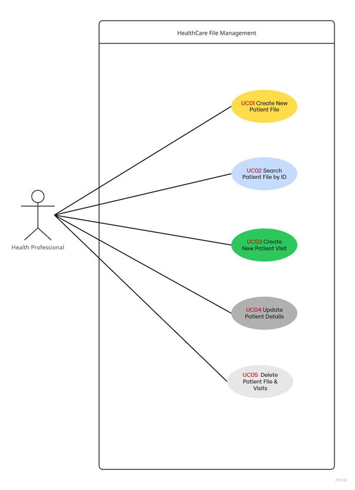
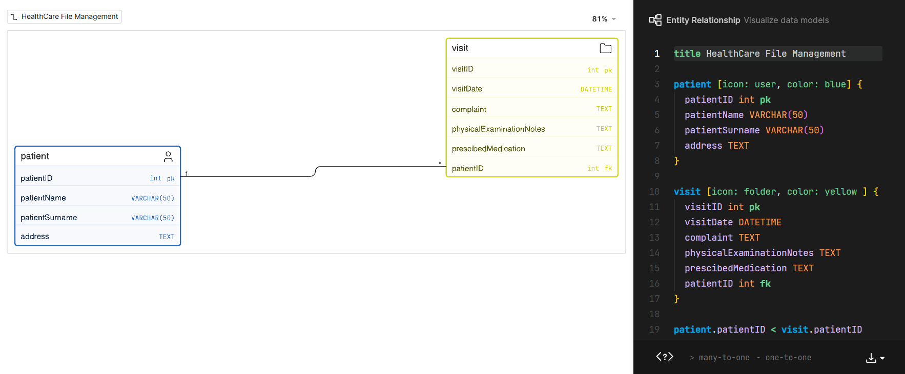
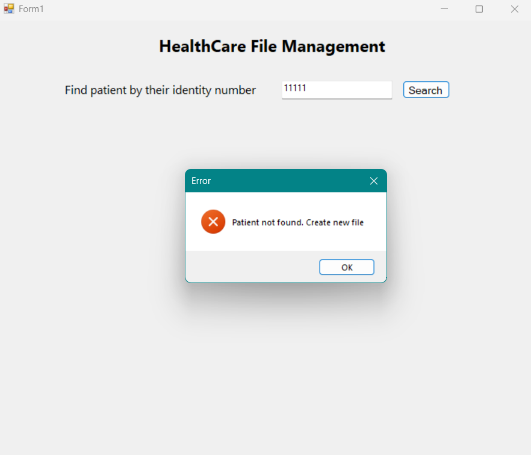
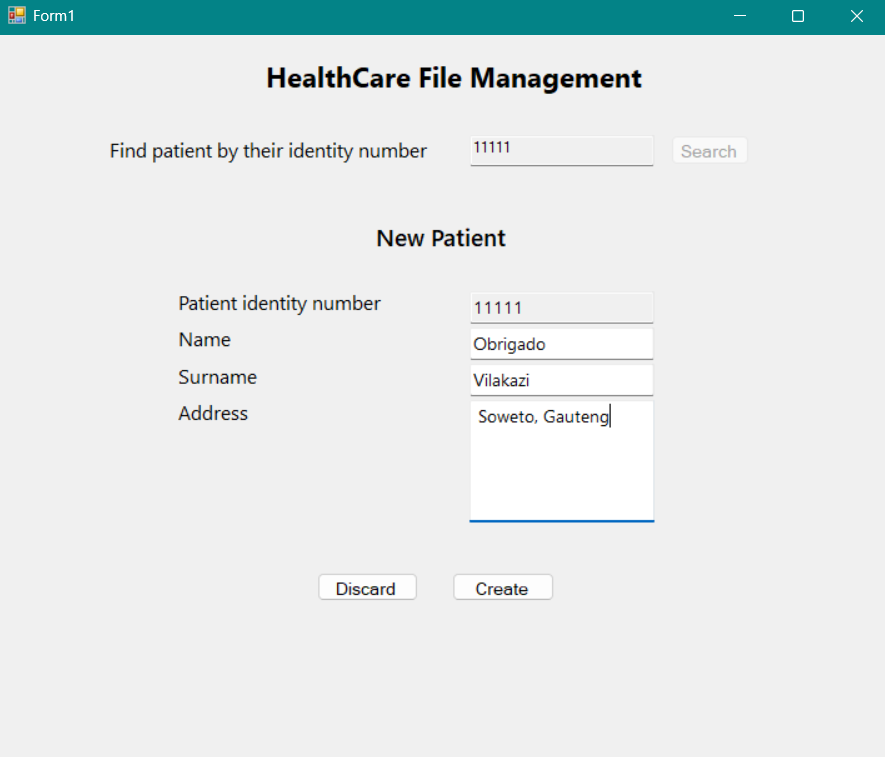
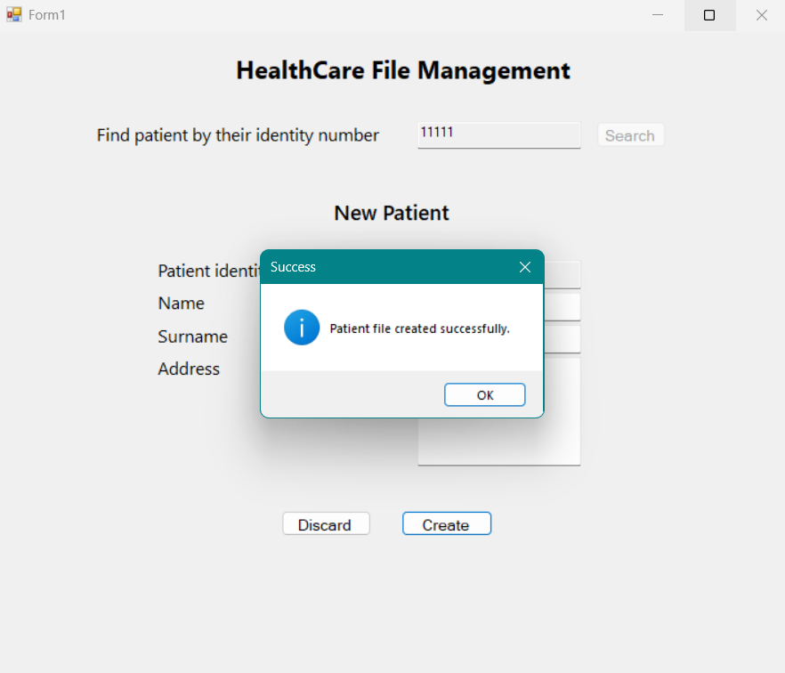
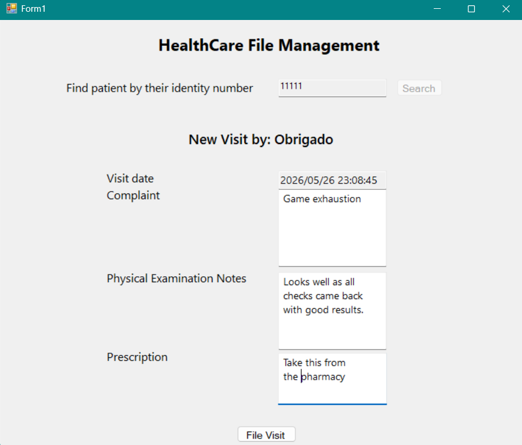
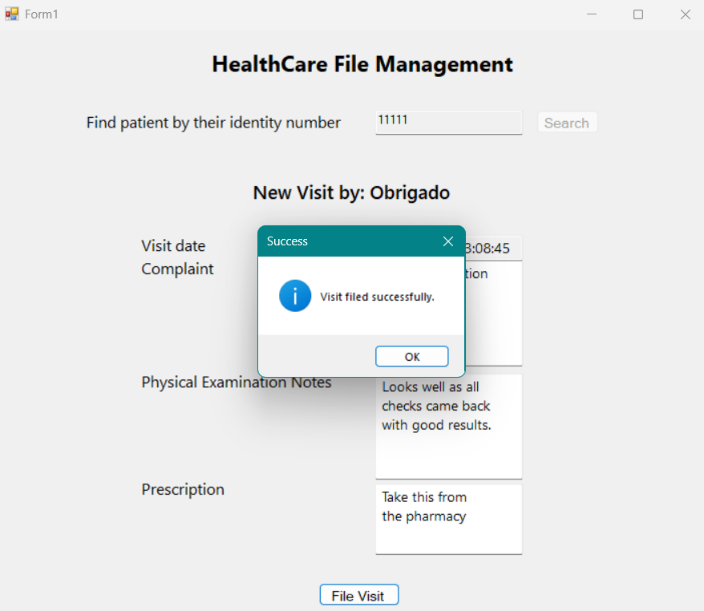
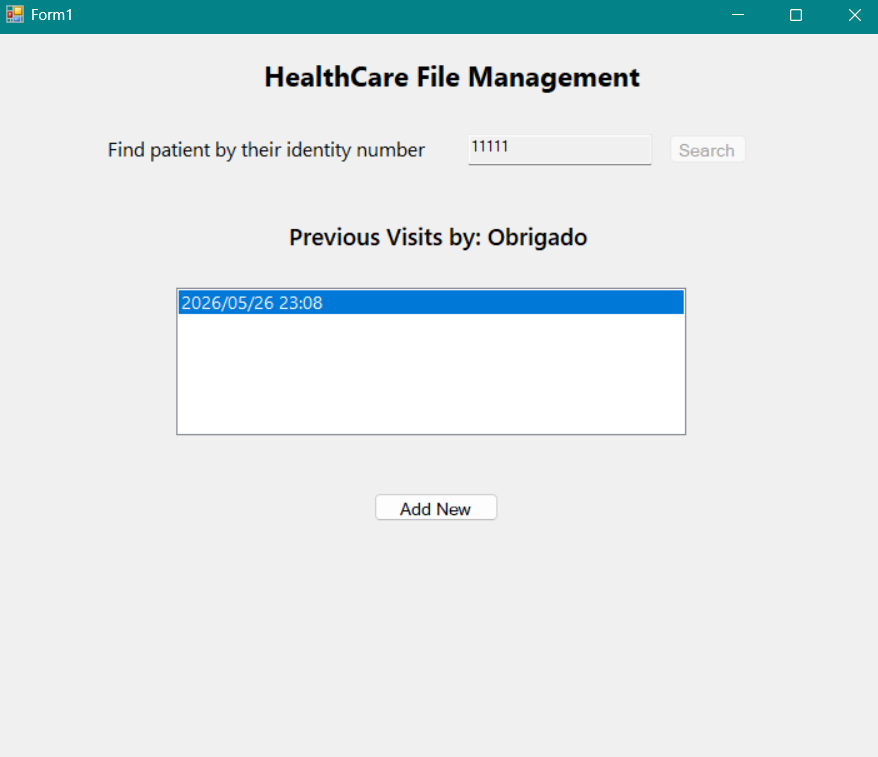

# HealthCare File Management <i>(in progress)</i>

## Background

* Patient comes to visit and a health professional searches for their file by their ID
* if the file is found then:
  * A new visit record is opened for the patient on their file
  * each visit has the visit date, patient complaint, physical examination notes and prescribed medication
* If the file is not found then:
  * The health professional will create a new one by taking the patient's details
  * After that a new visit record will be opened for the patient on their file

## Use case diagram

* This was archieved with Miro.com
 

  

## Entity relation diagram

* This was archieved with Eraser.io

  

## User interface

  
  
  
  
  
  

